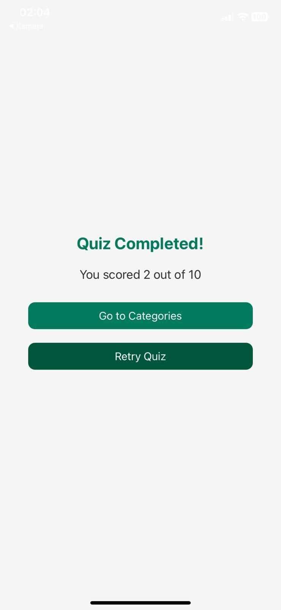

# Trivia Game

A React Native Trivia Game that allows users to select categories and answer questions.

## Features
- Multiple categories
- Randomized questions and answers
- Live scoring
- Results screen with summary

## Screenshots
### Categories Screen


### Quiz Screen


### Results Screen


## How to Run
1. Clone the repository:
   ```bash
   git clone https://github.com/kullaniciadi/trivia-game.git
